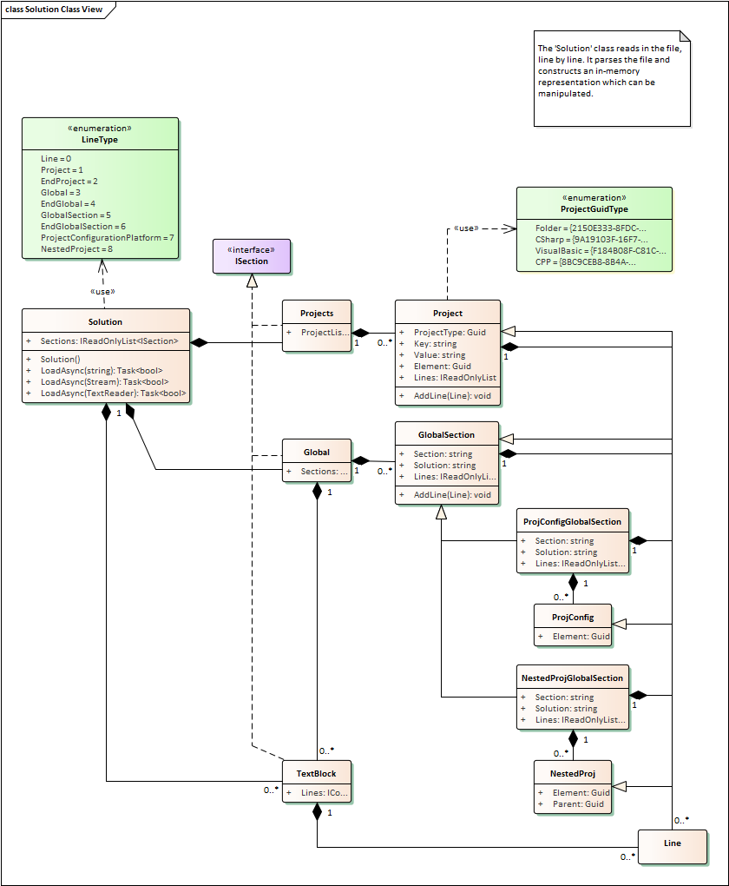

# Design for VsSolutionSort <!-- omit in toc -->

On large Visual Studio projects, adding new projects to a solution gits mixed,
and it is difficult to compare with other versions of the solution file. This
project tries to solve that.

- [1. Solution Parser](#1-solution-parser)
  - [1.1. Parsing Design](#11-parsing-design)
- [2. The Solution File Format](#2-the-solution-file-format)
  - [2.1. Collected GUID Types](#21-collected-guid-types)

## 1. Solution Parser

The class `Parser.Solution` uses a `TextReader` to read individual lines from a
`.sln` file and parses each line to determine the structure. Once the entire
solution file is read in memory, we can query the structures to perform sorting
as we require.

Once the file is read, it provides a structure similar to:



The `Solution` class contains a `IReadOnlyList<ISection> Sections`, which when
enumerated present the blocks of lines read from the solution file. By
enumerating over the list, we get:

- Any unparsed text blocks, such as the header, through `TextBlock : ISection`
- Each `Project` as a list contained in `Projects : ISection`
- The a list of further global sections contained in `Global : ISection`

If the element in the list implements `Line`, it also contains the line that was
parsed to generate the object. That object then contains all relevant
information similar to the structure of the solution file.

### 1.1. Parsing Design

The parser is line based and each line is considered one statement. When parsing
a line, we expect some kind of inputs based on the previous lines (if any) we've
read.

This makes parsing simple. At each stage of reading the solution file, we expect
a set of lines, and apply a regular expression on each to test if the line is
the format we expect. If so, it might be a block, and we continue parsing
regular expressions that we expect for that block.

You'll see in the `Solution` class multiple calls to `RegisterParser` which
associates for a line type (the enumeration `LineType`), the function that
should be used for parsing (implementing `IParseLine`), and returning a
particular type that contains further information.


Through this mechanism we effectively create our in memory tree of the solution
file.

## 2. The Solution File Format

The format is empirically obtained based on existing samples. Therefore it will
be incomplete.

```text
Microsoft Visual Studio Solution File, Format Version 12.00
# Visual Studio Version 17
VisualStudioVersion = 17.6.33723.286
MinimumVisualStudioVersion = 10.0.40219.1
Project("{GUID_TYPE}") = "KEY", "VALUE", "{GUID_ELEMENT}"
EndProject
Global
    GlobalSection(SolutionConfigurationPlatforms) = preSolution
        Debug|Any CPU = Debug|Any CPU
        Release|Any CPU = Release|Any CPU
    EndGlobalSection
    GlobalSection(ProjectConfigurationPlatforms) = postSolution
        {GUID_ELEMENT}.Debug|Any CPU.ActiveCfg = Debug|Any CPU
        {GUID_ELEMENT}.Debug|Any CPU.Build.0 = Debug|Any CPU
        {GUID_ELEMENT}.Release|Any CPU.ActiveCfg = Release|Any CPU
        {GUID_ELEMENT}.Release|Any CPU.Build.0 = Release|Any CPU
    EndGlobalSection
    GlobalSection(SolutionProperties) = preSolution
        HideSolutionNode = FALSE
    EndGlobalSection
    GlobalSection(NestedProjects) = preSolution
        {GUID_ELEMENT} = {GUID_ELEMENT}
    EndGlobalSection
    GlobalSection(ExtensibilityGlobals) = postSolution
        SolutionGuid = {DF5AFD9F-E6EE-487F-9EF1-BE7B7540BA86}
    EndGlobalSection
EndGlobal
```

We read each `Project` entry where:

- The first GUID is a well known type, and is discussed briefly at [Visual
  Studio
  SDK](https://learn.microsoft.com/en-us/visualstudio/extensibility/internals/solution-dot-sln-file?view=vs-2022)
- Then we get the name of the GUID entry. The value might be the folder name, or
  the path to the project.
- The second GUID is the project unique identifier, which is used for
  referencing configuration data and nested structure.

Then we're interested in the `GlobalSection(ProjectConfigurationPlatforms)` as
we'll later want to sort these entries. The GUID element listed in this section
maps to the Project GUID element (the second entry).

Finally, we're interested in the `GlobalSection(NestedProjects)`. This contains
the folder structure, in the form of a Key / Value pair. The first GUID is the
project element GUID (mapping to the `Project` value entry above). This GUID key
is unique (that is, it isn't listed more than once). The second GUID is the
*parent* element. This should be the folder GUID type. Through this mechanism, a
directory like structure can be expressed. The sorting in the final output will be based on this nested structure.

If the nested structure doesn't exist, the structure is flat and sorting in the
solution file should be based on alphabetical sorting of the key given in the
solution `Project` entries.

### 2.1. Collected GUID Types

| GUID_TYPE                                | Type            | Key          | Value         |
| ---------------------------------------- | --------------- | ------------ | ------------- |
| `{2150E333-8FDC-42A3-9474-1A3956D46DE8}` | Folder          | Folder Name  | Folder Name   |
| `{9A19103F-16F7-4668-BE54-9A1E7A4F7556}` | C-Sharp Project | Project Name | Relative Path |
| `{F184B08F-C81C-45F6-A57F-5ABD9991F28F}` | VB Project      | Project Name | Relative Path |
| `{8BC9CEB8-8B4A-11D0-8D11-00A0C91BC942}` | C++ Project     | Project Name | Relative Path |

This project doesn't care about the GUIDs for the project types.
